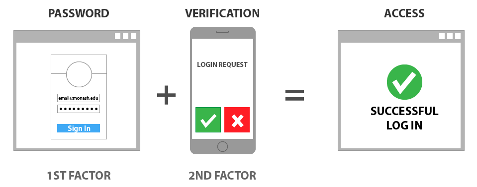
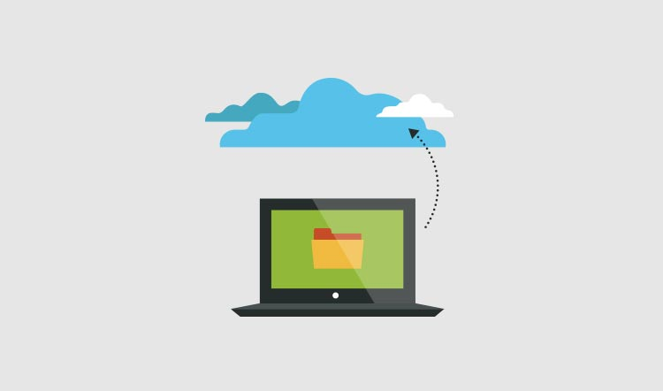


Even if you are not a boomer, this guide can still help you get your personal cyber security under control!


My parents mess up with technology all the time. Sometimes it's pretty simple stuff like using the same password for every login or more advanced stuff like the organisation responsible for their data was compromised (Optus). So I've distilled 5 simlpe steps that I (tech-savy son) teach my parents so they can avoid getting into trouble online. 

A lot of the time, using Google to find out how to secure a device or applicaiton will prove quite useful. However, if you are still unsure, this guide will serve you well.

## Update your devices

Cybercriminals can hack into your devices if they find weaknesses in the system or apps you're using. That's why it's important to keep your devices up to date with the latest software updates. You can turn on automatic updates so you don't have to worry about doing it yourself.

Turn on automatic updates on all your devices:

- Mobile phone
- Laptop
- Desktop
- Smart devices at home (vaccum cleaner, security cameras, washing machine, TV,  etc)

To turn on automatic updates, google search the product name and the phrase 'automatic updates'. There will be a website that will show you how to turn on automatic updates for the specific product.

Having said that, the Australian Cyber Security Centre has two guides on updating devices:

- [Microsoft Windows 10](https://www.cyber.gov.au/acsc/view-all-content/guidance/update-microsoft-windows)
- [Apple products](https://www.cyber.gov.au/acsc/view-all-content/guidance/update-apple-ios)

## Activate Multi-Factor Authentication (MFA)

Multi-Factor Authentication (MFA) is a super power for personal cyber security that is very undervalued by the older generation. If you can teach your parents how to use MFA, you will have saved them from a lot of grief down the line.

MFA helps protect your accounts by making it more difficult for hackers to access them. You can start by activating MFA on your most important accounts such as your email, online banking, and social media.

I suggest starting with your email account as this is probably used as your login username for a variety of other services that you use. Once that is secure with MFA, move to your social media and online banking (if your bank supports MFA, some do not).

I highly recommend using an authenticator app which keeps all your MFA tokens in one place and is super easy to use. I personally use Microsoft Authenticator, but there are a variety of apps out there to choose from.

If you use any of the below services, the Australian Government has got you covered with some excellent guides for you to follow:

- [Apple ID](https://www.cyber.gov.au/acsc/view-all-content/guidance/turning-two-factor-authentication-apple-id)
- [Facebook](https://www.cyber.gov.au/acsc/view-all-content/guidance/turning-two-factor-authentication-facebook)
- [Gmail](https://www.cyber.gov.au/acsc/view-all-content/guidance/securing-google-accounts)
- [Instagram](https://www.cyber.gov.au/acsc/view-all-content/guidance/turning-two-factor-authentication-instagram)
- [LinkedIn](https://www.cyber.gov.au/acsc/view-all-content/guidance/turning-two-factor-authentication-linkedin)
- [Microsoft](https://www.cyber.gov.au/acsc/view-all-content/guidance/securing-microsoft-accounts)
- [Signal](https://www.cyber.gov.au/acsc/view-all-content/guidance/securing-signal)
- [Twitter](https://www.cyber.gov.au/acsc/view-all-content/guidance/turning-two-factor-authentication-twitter)
- [WhatsApp and WhatsApp Business](https://www.cyber.gov.au/acsc/view-all-content/guidance/securing-whatsapp)
- [Yahoo!](https://www.cyber.gov.au/acsc/view-all-content/guidance/turning-two-factor-authentication-yahoo)

## Backup your devices

It's important to backup your devices regularly in case they're lost, stolen, or damaged. This way, you can restore your files and information if you need to. You can backup your devices to an external storage device or to the cloud. Most devices will have an automatic cloud backup for you to use. Again, use Google to identify how to backup the device as this will vary for different products.

Regularly backup your personal devices, such as:

- Mobile phone
- Laptop
- Desktop
- Tablet

If you use the below products, the Australian Government has once again delivered an easy-to-understand guide to set up automatic backups and how to restore your backup files in the event of data loss:

- Apple Mac: backing up to an [external storage device](https://www.cyber.gov.au/acsc/view-all-content/guidance/backing-and-restoring-your-files-mac-using-external-storage-device) or the [cloud](https://www.cyber.gov.au/acsc/view-all-content/guidance/backing-and-restoring-your-files-mac-cloud).
- Apple iPhone: backing up to the [cloud](https://www.cyber.gov.au/acsc/view-all-content/guidance/backing-and-restoring-your-files-iphone-cloud).
- Microsoft Windows 10: backing up to an [external storage device](https://www.cyber.gov.au/acsc/view-all-content/guidance/backing-and-restoring-your-files-pc-using-external-storage-device) or the [cloud](https://www.cyber.gov.au/acsc/view-all-content/guidance/backing-and-restoring-your-files-pc-cloud).

## Set secure passphrases

As mentioned above, MFA is one of the most effective ways to protect against unauthorised access to valuable information and accounts.However, in cases where MFA is not available (some online banking services for example), a passphrase can often be the only barrier between cybercriminals and your information.

So if a single passphrase is the only thing between your information and cybercriminals, we need to make sure that passphrase is very hard to break.

")

Passwords are [passé](https://www.google.com/search?q=passe). Passphrases are the future.

As we have increased our reliance on passwords, cybercriminals have developed increasingly sophisticated ways to crack them. In attempting to make passwords stronger, we have made them harder for humans to remember, and easier for machines to crack. Hence, the need for passphrases that are easy for humans to remember, and harder for machines to crack.

Your passphrase should have the following characteristics:

- Long: The longer your passphrase, the better. Make it at least 14 characters in length.
- Unpredictable: Use a random mix of unrelated words. For example, ‘red house sky train’, ‘sleep free hard idea’ or ‘crystal onion clay pretzel‘.
- Unique: Do not reuse passphrases on multiple accounts. Use a password manager to keep all your passwords in one place.

For more advice on how to build strong passphrases, see the ACSC’s Creating Strong Passphrases guidance.

## Watch out for scams

Cybercriminals use various methods to trick you into revealing sensitive information or transferring money. Be wary of messages that claim to be from official sources or have a sense of urgency or scarcity. If you're unsure about a message, don't click on any links or give away personal information.

Cybercriminals use email, SMS, phone calls and social media to trick you into opening an attachment, visiting a website, revealing account login details, revealing sensitive information or transferring money or gift cards. These messages are made to appear as if they were sent from individuals or organisations you think you know, or you think you should trust.

To spot scam messages, stop and think:

Authority: Is the message claiming to be from someone official?
Urgency: Are you told you have a limited time to respond?
Emotion: Does the message make you panic, fearful, hopeful or curious?
Scarcity: Is the message offering something in short supply?
Current events: Is this message related to current news stories, big events or specific times of year (like tax reporting)?
To check if a message is legitimate:

Go back to something you can trust. Visit the official website, log in to your account, or phone their advertised phone number. Don’t use the links or contact details in the message you have been sent or given over the phone.
Check to see if the official source has already told you what they will never ask you. For example, your bank may have told you that they will never ask for your password.

For more information on spotting scam messages, see the ACSC’s Detecting Socially Engineered Messages guidance.

## Further Info

The Australian Government has some great material on the [Australian Cyber Security Centre](https://www.cyber.gov.au/acsc/individuals-and-families) website for individuals and families.

Remember, keeping yourself safe online doesn't have to be difficult. By following these simple steps, you can protect yourself and your information from cybercriminals. If you need any help or have any questions, don't hesitate to ask me.
