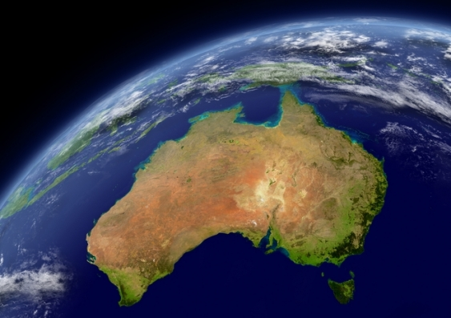
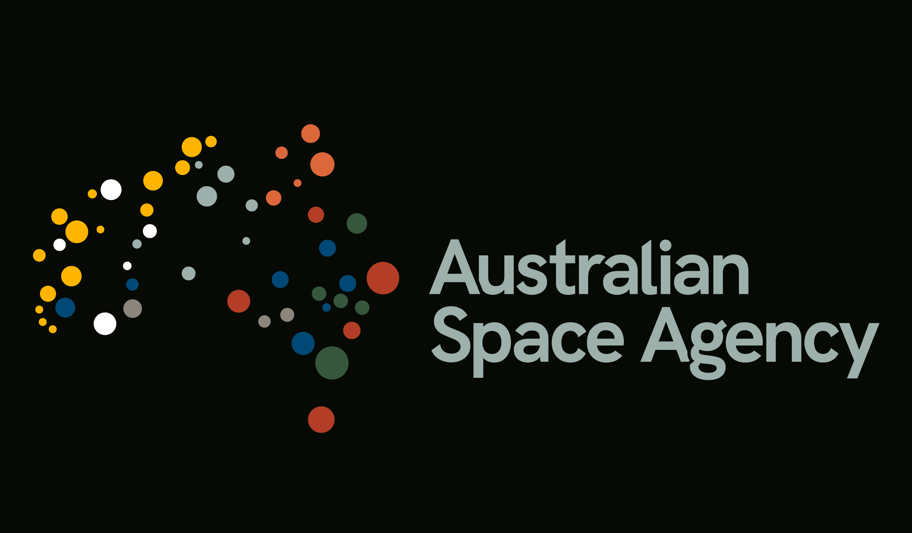
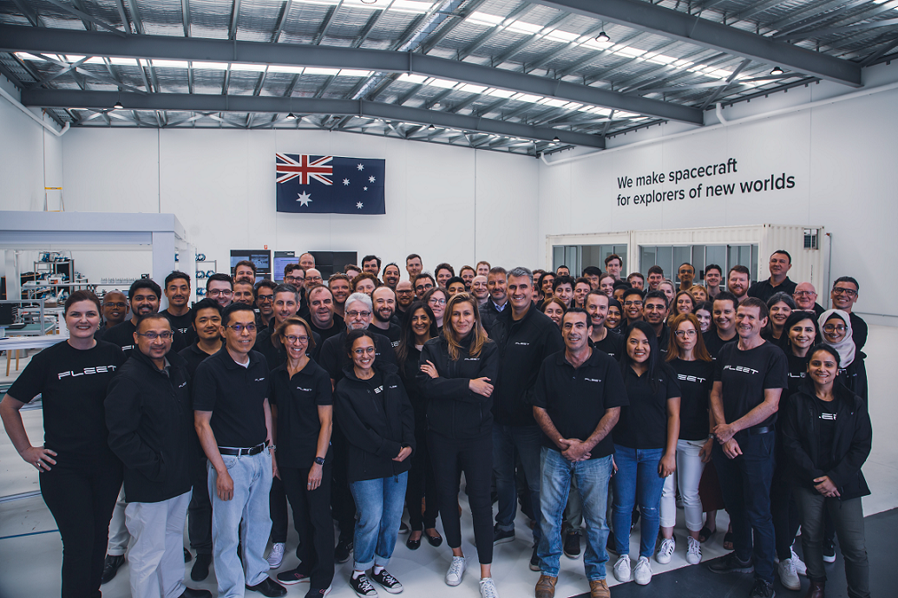

> A surface level look at Adelaide's next major industry


This article was published in [Ad-Lib: The Comeback Edition](https://issuu.com/sayounglibs/docs/ad-lib30112020), on Nov 30, 2020.


## Overview

The Australian space sector is on a steep trajectory to become a major part of the Australian economy with its diverse labour force, and high export earnings due to advanced technology products and services. With the recent commercial rocket launch from a test site north of Ceduna, South Australia, the national space industry is once again in headlines around the country, prompting students, and young professionals to seriously consider a role in the sector as a future career.

This article will explore the Australian space industry, its future impact on our economy, and careers for young people looking to work in a cutting-edge technology sector in South Australia.

## The Big Announcement

In 2008, Australia was the one of the two OECD countries without a space agency other than Iceland. The previous National Space Program and Australian Space Office were disbanded by the Howard Government in 1996 after a review of the National Space Program concluded that there was little demonstrable benefit to Australia. At the time, Australia did not necessarily need a space agency as Australia already had well-developed infrastructure and capabilities to derive data from space-based sources through the Bureau of Meteorology and Geoscience Australia.

During the International Astronautical Congress in Adelaide in 2017, Senator Simon Birmingham announced the launch of a national space agency by the federal government of Australia. The agency would focus on facilitating the growth of Australian businesses in the global space industry, which was estimated to be worth, US$345 billion. To achieve this, the Australian Space Agency (the Agency) plans on tripling the Australian space economy to $12 billion annually and create up to 20,000 more jobs by 2030.

## The Australian Space Agency

Being a commercially focused space agency is an important distinction for the Agency. In contrast, other space agencies like the European Space Agency (ESA) and the National Aeronautics and Space Administration (NASA), are state space operations, that seek to use their budget to provide their own launch services (putting rockets into space), build their own satellites and scientific payloads, and have their own human spaceflight or interplanetary robotic missions or both. However, our agency aims to develop space capability services through Australian businesses that have a globally competitive advantage and emerging technology such as [Myriota](https://myriota.com/) and [Fleet](https://fleetspace.com/).

So rather than the government owning and operating the rockets, satellites, and spacecraft – it will be Australian businesses.

Our agency’s other major task is to monitor and contribute to the regulation of Australian space activities to meet international obligations and ensure national safety. So, while our agency won’t be building any space capability like NASA and ESA, the Agency will be promoting private industry development, and facilitating global commercial investment in Australian space businesses.

These Australian space businesses will be developing software, hardware, and other services that include the ability to launch from Australia carrying Australian satellites with Australian payloads – sovereign access to space.

Our agency wants to create a lean, agile, and adaptive domestic space industry that can compete with larger, less agile state-run space industries around the world, thus creating a competitive advantage for Australian businesses.

Creating sovereign access to space is a key driver for the Federal Government in their quest to build up nationally resilient capabilities so we don’t need to rely on our allies or other nations to provide these capabilities for us – particularly during times of geopolitical tension.

## Employment Opportunities

South Australia is already home to more than 60 organisations with 800 employees in the space sector and this number is growing rapidly. So how does an ambitious young person growing up in South Australia make the most of this growing industry?

* **STEM**: As the space industry is primarily a tech sector, engineering, science and mathematics-based careers will thrive and continue to make up a bulk of the high-paying and high-skill workforce, particularly people with masters or doctoral degrees.
* **Business/Accounting/Commerce**: The high growth areas within the Australian space sector are with the start-up companies and small businesses. While STEM backgrounds will be vital to developing new tech, small companies will have trouble transitioning from an SME to a large organisation without people from business and commercial backgrounds. There is room for people aspiring to get to the ‘C-level’ within a growing company with no STEM background. Young people with business skills will definitely find a place in the growing space sector in taking small, high-growth start-ups to mature companies with million-dollar cash flows in the next 5+ years.
* **Law**: Space law will continue to grow in Adelaide, particularly with the University of Adelaide having strong expertise in space law and the intensive course on Strategic Space Law they offer to the general public. Young lawyers interested in working in the space sector can take advantage of the Agency’s APS grad program, IP/patent law firms or consulting businesses that work with companies from around the world to navigate the Australian space regulatory environment.

As the sector grows in size and the technology diversifies (space agriculture, space medicine, interplanetary migration law) more opportunities for young people will become available leading to further jobs and growth for South Australia.

## Summary

The Australian space sector is an exciting and diverse industry to be working in for any young Australian. With both State and Federal Government keen to invest more money into the state and national space industry, sector growth will spur further opportunities for young people from a variety of different career backgrounds. The prospects for growth are clear. Australia is well placed to build our own small satellites and launch them into space, which will build a space export industry alongside a domestic one.

Any young South Australian is well placed to take advantage of recent industry movement as Adelaide becomes a key centre of space activity in the next 5 years that will ultimately transform Australia’s role in space at a global level.